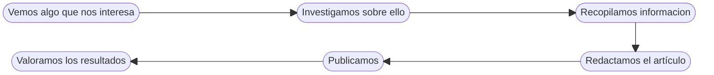
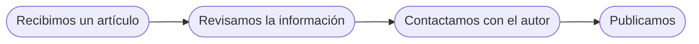

# Nuestro *Modus operandi*

A la hora de publicar un artículo, seguimos el siguiente proceso:

Mediante estos pasos, logramos que nuestro sitio se pueda definir mediante dos características principales: **calidad** y **coherencia**. Además, para publicar artículos que nos envía la comunidad seguimos el siguiente diagrama:

